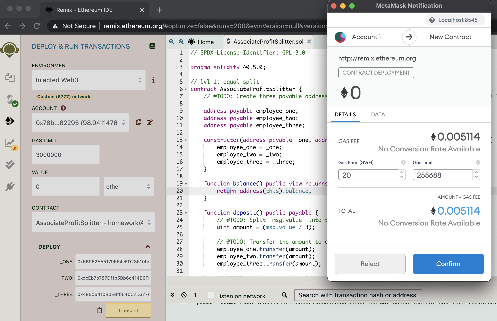
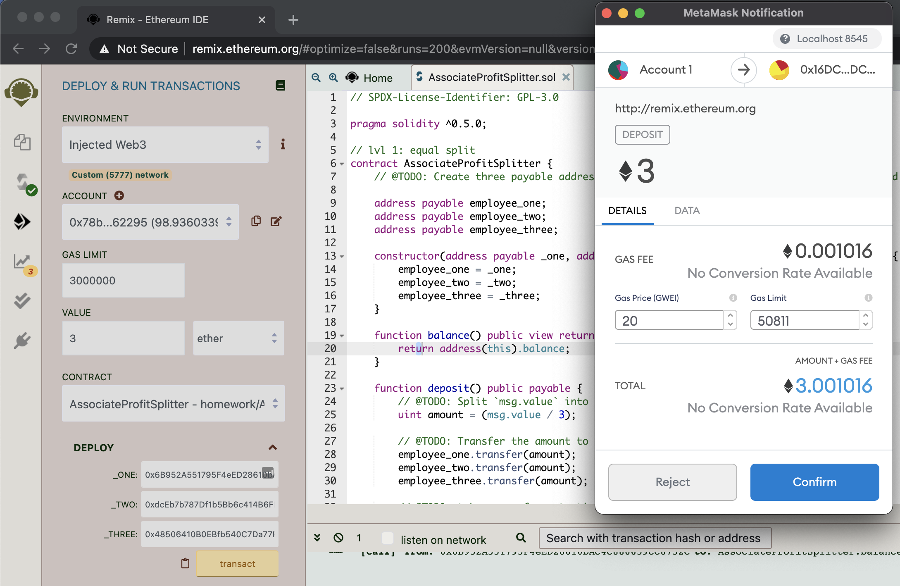
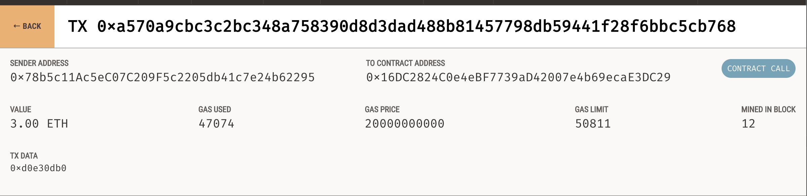
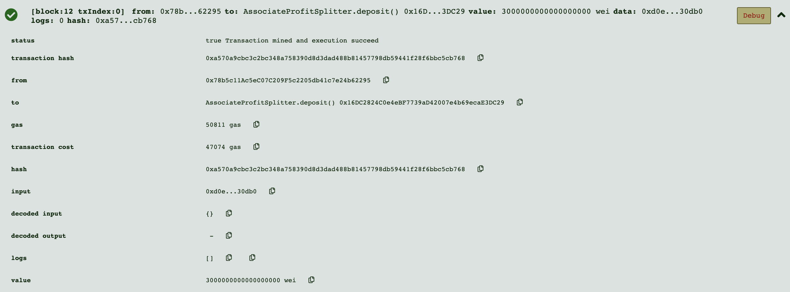

# Profit Splitter Smart Contract

This contract was created for the HR team to be able to employees their profit sharing proceeds. This contract allows us to deploy one contract to send three employees money.

## Deploying the Contract

Before money can be sent to any employee, the contract must first be deployed into the network with 0 value. Additionally, the addresses of the three employees need to be provided.

## Processing a Transaction

After the contract is deployed and confirmed, then we are able to pass ether to the employees. You enter the value in the box below and then click the deposit button under the deployed contract. This will result in below output.

## Confirming Transaction Success

After the transaction is confirmed, you are provided with a hash number. This hash will be mined and the transaction will be processed. The transaction can be seen in Ganache under the account the ether was sent from. This is also reflected in the Remix IDE.

 
